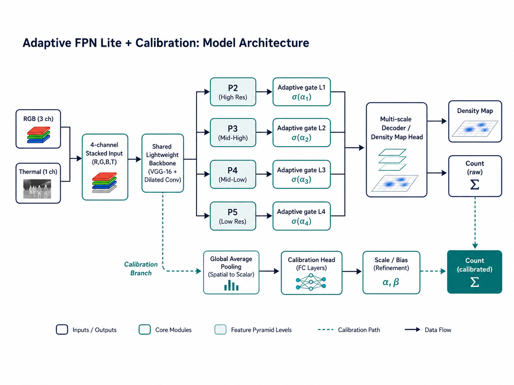
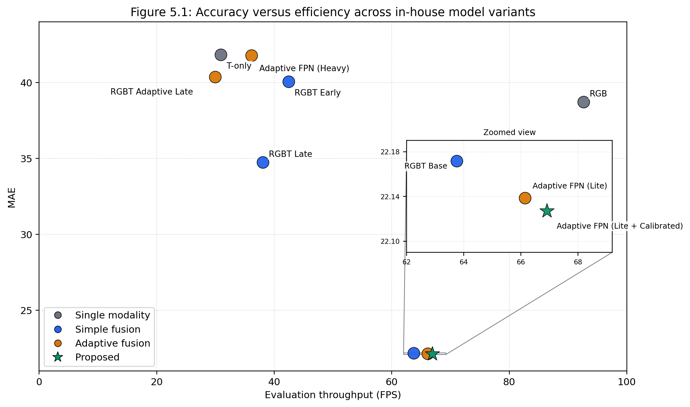
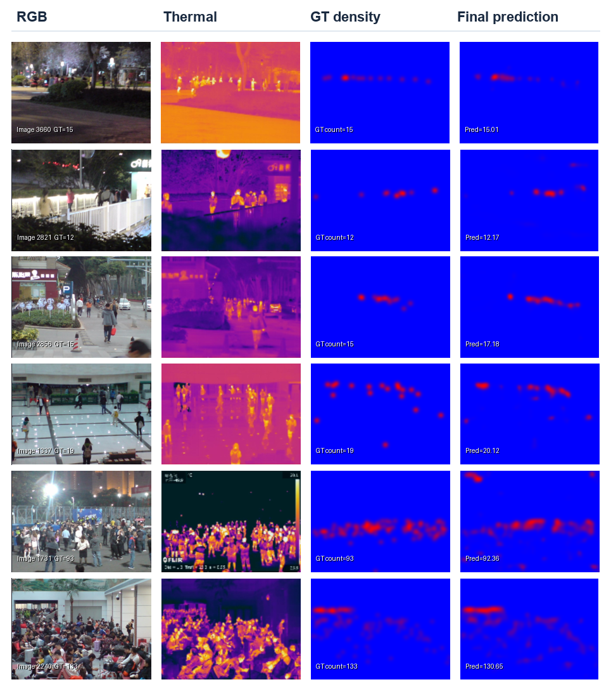
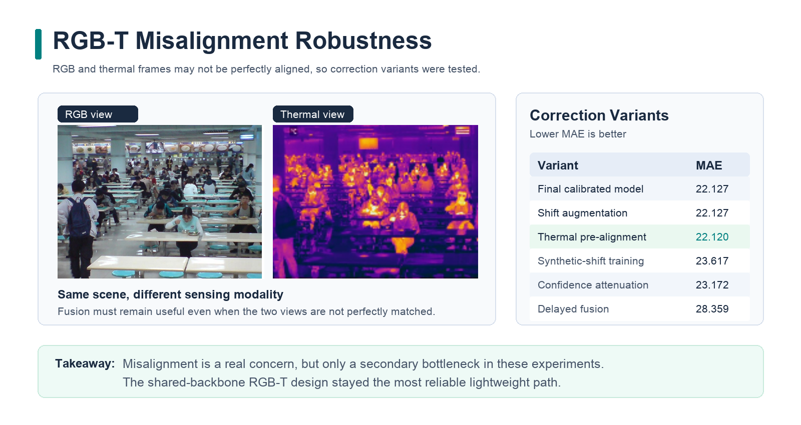

# Smart Object Counter FYP

Lightweight RGB-T crowd counting for surveillance-oriented deployment.

This repository contains the code, cluster jobs, and report-support utilities used for a final year project on **Adaptive FPN Lite + Calibration**, a lightweight RGB-T crowd counting model evaluated on the **RGBT-CC** benchmark.

The in-house model progression covered in this project is:

- unimodal baselines: `rgb`, `t`
- standard multimodal baselines: `rgbt_early`, `rgbt_late`, `rgbt_base`
- adaptive fusion exploration: `rgbt_adaptive_late`, `rgbt_adaptive_fpn`
- lightweight adaptive progression: `rgbt_adaptive_fpn_lite`, `rgbt_adaptive_fpn_lite_cal`

The final proposed model is **Adaptive FPN Lite + Calibration**, implemented in `models/rgbt_adaptive_fpn_lite_cal.py` and run through `scripts/train_rgbt.py` / `scripts/eval_rgbt.py`.

## Project Highlights

| Model | Parameters | FPS | MAE | RMSE |
| --- | ---: | ---: | ---: | ---: |
| RGB-only | 16.26M | 92.65 | 38.711 | 63.981 |
| Thermal-only | 16.26M | 30.93 | 41.823 | 73.093 |
| RGBT Base | 16.26M | 63.75 | 22.172 | 38.028 |
| RGB-T Adaptive Late | 32.53M | 29.97 | 40.359 | 73.284 |
| RGB-T Adaptive FPN | 50.72M | 36.15 | 41.774 | 76.812 |
| **Adaptive FPN Lite + Calibration** | **16.44M** | **66.91** | **22.127** | **37.938** |

The main result is that RGB-T fusion gives a clear gain over either modality alone, while the final lightweight model keeps the practical speed and parameter profile close to the strong shared-backbone baseline.

## Visual Overview

### Proposed Architecture



### Accuracy-Efficiency Tradeoff



### Qualitative Density Map Examples

The model predicts a density map, and the final crowd count is obtained by summing over the predicted density values.



### RGB-T Misalignment Robustness

RGB and thermal views may be slightly misaligned in practice, so robustness variants were tested to check whether explicit correction improves fusion.



## Repository Overview

```text
FYP-SmartObjectCounter/
├── datasets/                         Dataset loading and density-map generation
├── models/                           In-house model definitions
├── scripts/                          Training, evaluation, benchmarking, and figure scripts
├── pbs/                              NSCC PBS job scripts
├── third_party/                      External code used only for contextual benchmarking
├── weights/                          External BM inference weights
├── logs/                             Runtime logs from training/evaluation/figures
├── outputs/                          Runtime checkpoints and generated outputs
├── requirements.txt                  Python helper dependencies
└── README.md
```

## Directory Guide

### `datasets/`

Dataset wrappers and density-map utilities.

- `rgbt_cc.py`
  - main RGBT-CC dataset handling
  - supports RGB-only, thermal-only, early fusion, paired, and base modes
- `density.py`
  - density-map generation helpers
- `shtb.py`
  - legacy ShanghaiTech utilities from earlier experiments

### `models/`

All in-house model definitions used in the project.

- `csrnet.py`
  - CSRNet-style counting backbone
- `resnet_cc.py`
  - ResNet counting baseline components
- `rgbt_base.py`
  - strong 4-channel RGB-T shared-backbone baseline
- `rgbt_early.py`
  - early-fusion baseline
- `rgbt_late.py`
  - dual-stream late-fusion baseline
- `rgbt_adaptive_late.py`
  - adaptive late-fusion exploration
- `rgbt_adaptive_fpn.py`
  - heavier adaptive FPN exploration model
- `rgbt_adaptive_fpn_lite.py`
  - lightweight adaptive FPN Lite model
- `rgbt_adaptive_fpn_lite_cal.py`
  - final proposed Adaptive FPN Lite + Calibration model

### `scripts/`

Python entry points for the main workflows.

- `train_rgbt.py`
  - main trainer for the in-house RGB-T models
- `eval_rgbt.py`
  - main evaluator for the in-house RGB-T models
- `train_rgbt_adaptive_fpn.py`
  - legacy heavy adaptive FPN trainer
- `eval_rgbt_adaptive_fpn.py`
  - legacy heavy adaptive FPN evaluator
- `benchmark_bm_sota.py`
  - inference-only BM / SOTA efficiency benchmark
- `compare_count_bins_rgbt_vs_bm.py`
  - scene-level latency / FPS comparison across crowd-count bins
- `export_report_qualitative.py`
  - exports qualitative figure panels for the report
- `make_figure_5_1_scatter.py`
  - generates the accuracy-efficiency scatter plot used in the report

### `pbs/`

Cluster jobs used to run the experiments on NSCC.

Key jobs:

- `train_rgbt_adaptive_fpn_lite_cal_tuned_e400.pbs`
- `eval_rgbt_adaptive_fpn_lite_cal_test.pbs`
- `benchmark_bm_sota_infer.pbs`
- `compare_count_bins_rgbt_vs_bm.pbs`
- `export_figure_5_2_density_compare.pbs`
- `export_figure_5_3_failure_cases.pbs`
- `make_figure_5_1_scatter.pbs`

### `third_party/`

External code used only for contextual benchmarking.

- `Broker-Modality-Crowd-Counting/`
  - BM / SOTA reference implementation used for inference benchmarking only

### `weights_broker_modality/`

Local BM weight files used by the contextual benchmark.

- `released_finetuned_model.ckpt`
- `vgg19-dcbb9e9d.pth`

### `logs/` and `outputs/`

Runtime artefacts rather than source code.

- `logs/`
  - training, evaluation, benchmarking, and figure-generation logs
- `outputs/`
  - checkpoints, benchmark artefacts, and generated figure outputs

These folders are useful while running experiments, but they are not the core source tree.

## Expected Dataset Layout

The PBS jobs and main scripts expect the dataset at:

```text
data/RGBT-CC-CVPR2021/
├── train/
├── val/
└── test/
```

At a high level, each sample is expected in the project naming style:

```text
<id>_RGB.jpg or .png
<id>_T.jpg or .png
<id>_GT.json or .mat
```

Example:

```text
0001_RGB.jpg
0001_T.jpg
0001_GT.json
```

## Simple Setup

### Local environment

```bash
git clone <your-repo-url>
cd FYP-SmartObjectCounter

python3 -m venv .venv
source .venv/bin/activate
pip install -r requirements.txt
```

Notes:

- `requirements.txt` does not pin a PyTorch build.
- Install PyTorch separately to match your local machine.
- The NSCC jobs in this project used `pytorch/2.6.0-py3-cu11.8`.

### BM / SOTA benchmark prerequisites

If you want to run the BM benchmark, make sure both of these exist:

- `third_party/Broker-Modality-Crowd-Counting/`
- `weights_broker_modality/`

The BM / SOTA inference code used here is based on the public GitHub repository:

- [HenryCilence/Broker-Modality-Crowd-Counting](https://github.com/HenryCilence/Broker-Modality-Crowd-Counting)

Required BM files:

```text
weights_broker_modality/released_finetuned_model.ckpt
weights_broker_modality/vgg19-dcbb9e9d.pth
```

## Running the Final Proposed Model

### Recommended workflow on NSCC

1. Train `Adaptive FPN Lite + Calibration`
2. Evaluate it on the official test split
3. Optionally benchmark BM / SOTA for contextual efficiency
4. Optionally generate report figures

### 1. Train the final model

```bash
qsub pbs/train_rgbt_adaptive_fpn_lite_cal_tuned_e400.pbs
```

This job:

- trains for 400 epochs
- warm-starts from the latest available `rgbt_base` checkpoint if present
- validates at full resolution
- writes outputs under:

```text
outputs/train_rgbt_adaptive_fpn_lite_cal_tuned_e400/<JOBID>_<TIMESTAMP>/
```

### 2. Evaluate the final model

```bash
qsub pbs/eval_rgbt_adaptive_fpn_lite_cal_test.pbs
```

By default, this job finds the latest available `adaptive_fpn_lite_cal` checkpoint and writes the evaluation JSON to `logs/eval/`.

To evaluate a specific checkpoint:

```bash
qsub -v CKPT_OVERRIDE=/scratch/users/ntu/kenneth0/FYP-SmartObjectCounter/outputs/train_rgbt_adaptive_fpn_lite_cal_tuned_e400/<RUN_DIR>/best.pth pbs/eval_rgbt_adaptive_fpn_lite_cal_test.pbs
```

### 3. Manual evaluation command

```bash
python3 -u scripts/eval_rgbt.py \
  --root data/RGBT-CC-CVPR2021 \
  --split test \
  --mode adaptive_fpn_lite_cal \
  --ckpt /path/to/best.pth \
  --img_h 768 \
  --img_w 1024 \
  --out_stride 8 \
  --sigma 15.0 \
  --batch_size 1 \
  --num_workers 4 \
  --device cuda
```

## Running Other In-House Experiments

The main trainer supports:

- `rgb`
- `t`
- `base`
- `early`
- `late`
- `adaptive_late`
- `adaptive_fpn_lite`
- `adaptive_fpn_lite_cal`

Example manual training command:

```bash
python3 -u scripts/train_rgbt.py \
  --mode adaptive_fpn_lite_cal \
  --data_root data/RGBT-CC-CVPR2021 \
  --out_dir outputs/manual_adaptive_fpn_lite_cal \
  --epochs 400 \
  --batch_size 1 \
  --workers 4 \
  --lr 3e-6 \
  --gate_lr 1e-5 \
  --weight_decay 5e-4 \
  --use_onecycle \
  --max_lr 1e-5 \
  --max_gate_lr 3e-5 \
  --freeze_backbones_epochs 20 \
  --crop_size 224 \
  --sigma 15.0 \
  --down 8 \
  --lambda_cnt 2e-3 \
  --clip_grad 1.0 \
  --deterministic \
  --val_fullres \
  --val_img_h 768 \
  --val_img_w 1024 \
  --val_deterministic
```

For repeatable runs, prefer the checked-in PBS jobs over ad hoc commands.

## Contextual BM / SOTA Benchmarking

### Inference-only BM benchmark

```bash
qsub pbs/benchmark_bm_sota_infer.pbs
```

This benchmark is used only for:

- throughput
- latency
- memory
- parameter count

It is not a local reproduction of BM training or BM accuracy.
The inference reference implementation comes from:

- [HenryCilence/Broker-Modality-Crowd-Counting](https://github.com/HenryCilence/Broker-Modality-Crowd-Counting)

### Scene-level BM comparison across crowd-count bins

```bash
qsub pbs/compare_count_bins_rgbt_vs_bm.pbs
```

This job:

- selects representative scenes across count bins
- measures per-image latency and FPS
- saves side-by-side qualitative panels
- writes a `summary.json`

Outputs are written under:

```text
outputs/compare_count_bins/<JOBID>_<TIMESTAMP>/
```

## Final Notes

- Final proposed model: **Adaptive FPN Lite + Calibration**
- Strongest lightweight baseline: **rgbt_base**
- BM / SOTA is included only for contextual benchmarking and report comparison
- The main apples-to-apples comparison in this repository is among the in-house models trained with the same pipeline
